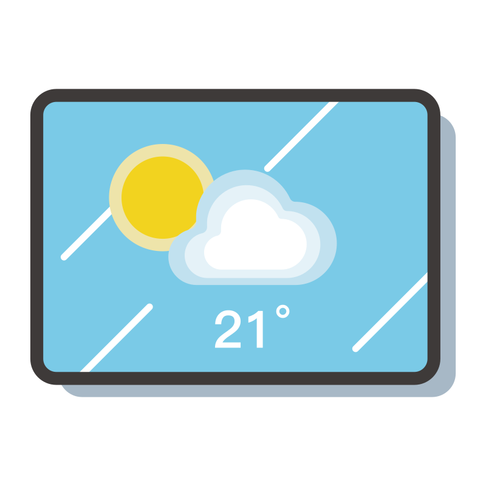
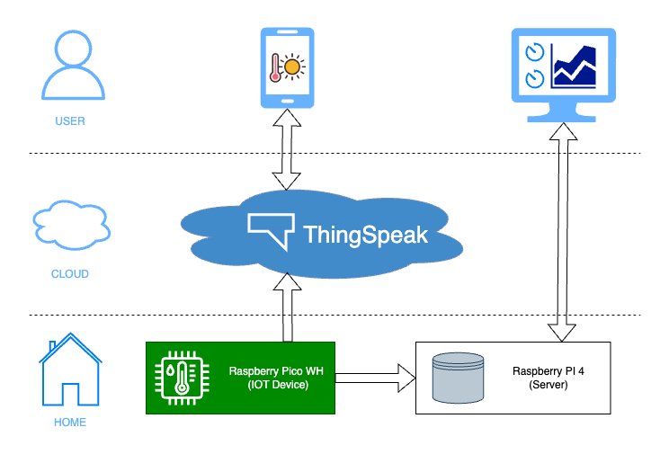
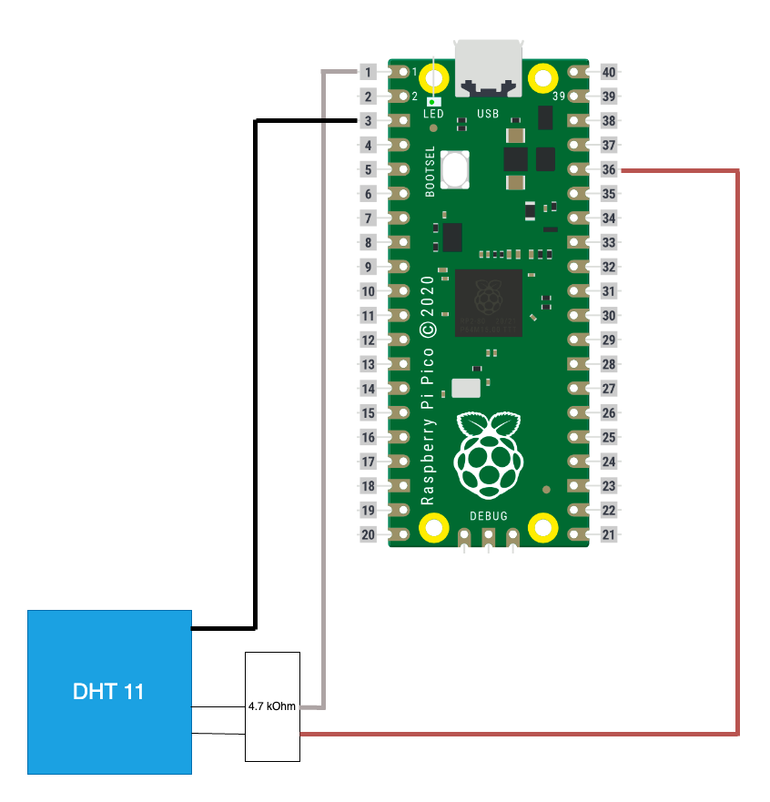

    

# Weather station
This project aims to make a Weather station using a Raspberry Pico WH as an IOT. A server will be setup to record the data acquisition and display it to the User through a web server. In this example we will be using a Raspberry Pi 4 to serve the website locally. The IOT will also publish on [ThingSpeak](https://thingspeak.com/) as a backup and a convient way to access our data remotely.

The web app provides users with the ability to view the latest acquired data and a plot representing the data from the past 24 hours. In contrast, the mobile app focuses on presenting users with the most recent data acquisition.

    

## Table of content
<!-- TOC -->

- [Weather station](#weather-station)
    - [Table of content](#table-of-content)
- [The decisions behind the design](#the-decisions-behind-the-design)
    - [Hardware](#hardware)
    - [Backend](#backend)
    - [App](#app)
- [Acknowledgements](#acknowledgements)
- [Built with](#built-with)
- [Getting Started](#getting-started)
    - [Software](#software)
    - [Hardware required](#hardware-required)
- [License](#license)

<!-- /TOC -->

# The decisions behind the design
## Hardware
I chose the Raspberry Pico WH because Raspberry is known for reliable hardware, have a large community, abundance of tutorials and educational content. It was also a conveniant choice as a "weather station pack" was available for a reasonnable price.

## Backend 
I chose to use my Raspeberry PI as a server. Any other solution that can accept Node JS could also be considered. As I did not want to expose my Raspberry PI publically, due to my lack of knowledge in cybersecurity, I decide to only allow the clients to connect to my server locally. The app is using the (free) API of ThingSpeak to gather the acquired data.

Concerning the choice of the framework, I first tried with Flask. With my current knowledge and the tools available today, I found that Node JS was more convenient in terms of maintainability. The pm2 manager made the all difference. It eased the process so much that it was the main reason to choose node js. Of course I have a very simple backend, if you want to do more things on python flask could be a better choice. But the amount of package available and the size of the community of Node JS make it an essential factor to weigh when making a decision.

## App
I chose to use .NET MAUI as a framework as it can be easily deployed on the different platefoms.

# Acknowledgements

This project would not have been possible without the following tools and libraries:

* [ThingSpeak](https://thingspeak.com/) : Allowing the developement of IOT project for free.
* [SVG Repo](https://www.svgrepo.com/) : For providing open-licensed SVG.
* [IconKitchen](https://icon.kitchen/) : A great Icon generator for all plateforms.
* [Inkscape](https://inkscape.org/) : The best tool to edit .svg
* [Othneil Drew](https://github.com/othneildrew/Best-README-Template/blob/master/README.md) : For providing great ideas for README files.
* [Img Shields](https://shields.io) : For improving a boring README.

# Built with

[![Node][Node.js]][Node-url]
[![DotNet][Dotnet.js]][Dotnet-url]
[![Python][Python]][Python-url]
[![Pi][Pi]][Pi-url]

# Getting Started

## Software

The software architecture is divided in 3 parts, each of them have their own readme:
* [IOT](./src/iot/README.md)
* [Mobile App](./src/mobile/mobile_app/README.md)
* [Server](./src/server/README.md)

## Hardware required
The hardware used is inspired from this [toolkit](https://www.pi-shop.ch/raspberry-pi-wetterstation-kit):
* Raspeberry Pico WH
* DHT11
* 4.7 kOhm resistor
* Breadboard 

The wiring is as followed:

# License
Distributed under the MIT License. See [LICENSE.txt](./LICENSE.txt) for more information.

<!-- MARKDOWN LINKS & IMAGES -->
<!-- https://www.markdownguide.org/basic-syntax/#reference-style-links -->
[Node.js]: https://img.shields.io/badge/node.js-000000?style=for-the-badge&logo=nodedotjs&logoColor=white
[Node-url]: https://nodejs.org/en
[Dotnet.js]:https://img.shields.io/badge/dotnet-000000?style=for-the-badge&logo=dotnet&logoColor=white
[Dotnet-url]:https://dotnet.microsoft.com/en-us/
[Python]:https://img.shields.io/badge/python-000000?style=for-the-badge&logo=python&logoColor=white
[Python-url]:https://www.python.org/
[Pi]:https://img.shields.io/badge/raspberry%20pi-000000?style=for-the-badge&logo=raspberrypi&logoColor=white
[Pi-url]:https://www.raspberrypi.com/
