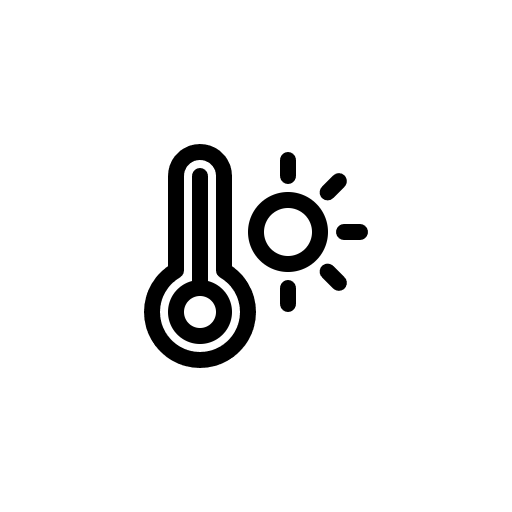

<div align="center">
    
</div>


# Mobile App

The following app will query the last accquired humidity and temperature through the ThingSpeak API and update the main User Interface.

## Requirements

* [Visual studio](https://visualstudio.microsoft.com/fr/vs/community/)
* [.NET MAUI](https://dotnet.microsoft.com/en-us/learn/maui/first-app-tutorial/install) 
* A phone to test it, for Android user allow the [develloper options](https://developer.android.com/studio/debug/dev-options)

## Disclaimer

The code present in this repository was developed using .NET MAUI which sould make it available on Android and IOS devices, however it was <u> only tested on a Google Pixel 6 running on Android 13</u>. Any other android device or apple device might not work.

## How to set it up

### Configure your app

In the file [MainViewModel.cs](./ViewModels/MainViewModel.cs), look for the lines:

```
// Replace this with your actual Thingspeak API key
        string apiKey = "<>";
        int results = 1;
        string apiUrl = $"https://api.thingspeak.com/channels/2156442/feeds.json?api_key={apiKey}&results={results}";
```

In your thingspeak dashboard, go to the channel for your project and look for your read api key. Updathe previous code accordingly. For example

```
// Replace this with your actual Thingspeak API key
        string apiKey = "TH0M45";
        int results = 1;
        string apiUrl = $"https://api.thingspeak.com/channels/2156442/feeds.json?api_key={apiKey}&results={results}";
```
### Deploy your app

The easiest way is to connect your device to your laptop by USB (you could also do it via Bluetooth). On Visual Studio you should see your device appearing on the selection next to the play button. Select it and choose "Release". Press play and Visual Studio should be installing your app on your phone. I would recommend to read the official [documentation](https://learn.microsoft.com/en-us/dotnet/maui/get-started/first-app?view=net-maui-8.0&tabs=vswin&pivots=devices-android) as the interface might change in the meantime.

You should find your application under "Home Weather" on your device.
