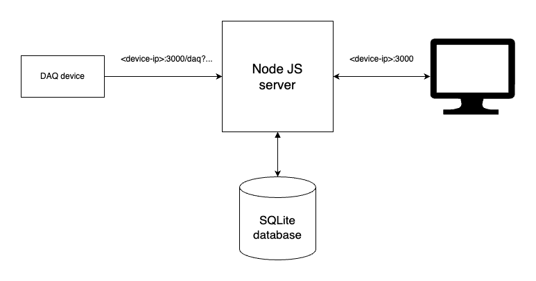

# Server



The server has currently two purposes:
* Store new data in the SQlite database from the POST query /daq
* Server a website that shows the current temperature and humidity as well as the measurements of the last 24 hours

The temperature is stored in the database in °C and the humidity in %. Each pair of data is saved in unix time, therefore UTC.

# Getting started

Node JS is running by default (and as configured in this project) on the port 3000. Therefore to be able to see your websiet you would need to go to
```
<your-device-ip>:3000
```
for example:
```
192.168.1.30:3000
```

You might need to make sure that this port can be accessed through the firewall. In this project we assume that your device can only be accessed through the local network. Therefore we will not put to much effort security wise.

## Update the Raspeberry PI

* Install Node.JS make sure to follow the latest instructions, for [example](https://www.w3schools.com/nodejs/nodejs_raspberrypi.asp)
* Install by running the following command : 
```
NPM npm install pm2 -g
```
* Checkout out this git

## Update the Node JS server

Connect to the server using SSH (assuming you are using a Raspberry PI or any UNIX device) and go to the directory where you have checkout this git.

Navigate to ther server.js directory:
```
cd /src/server/
```

Only if the app is running do
```
pm2 stop server.js
```
Update the code:
```
git pull
```

Restart the server : 
```
pm2 start server.js
```


